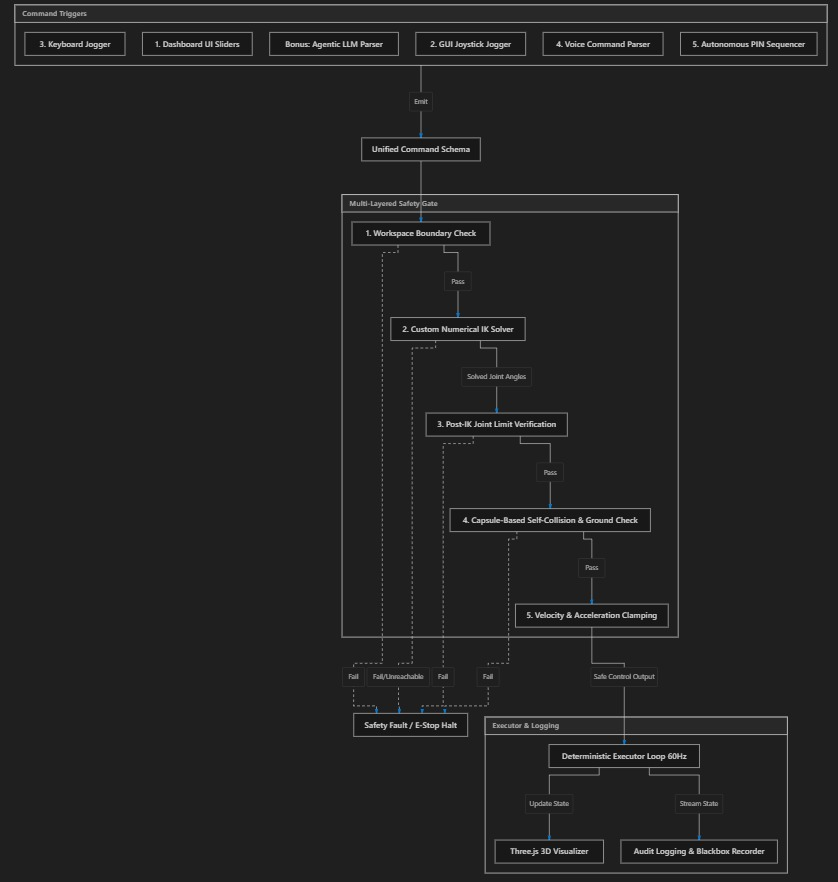
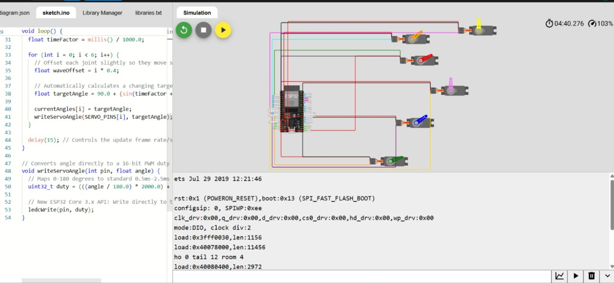
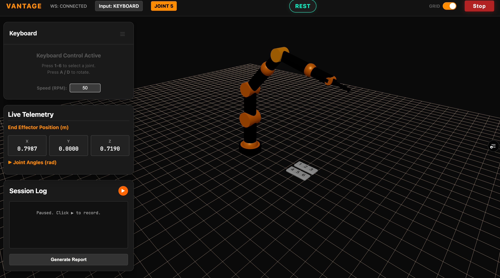
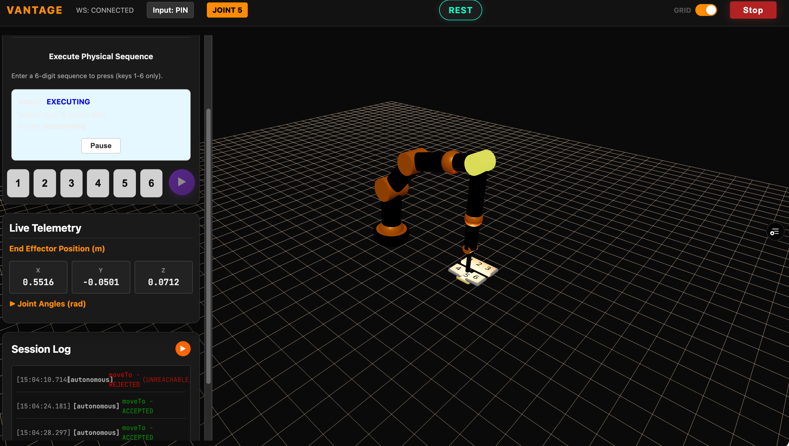

# Vantage Robotics - 6 DOF Robotic Arm Control



## Overview
Vantage Robotics is a fully functional, browser-based simulation for a 6 Degree-of-Freedom (DOF) robotic arm. Designed for versatility and ease of use, it allows seamless control through various input methods including Keyboard, Mouse, Gamepad, and Voice commands. 

This project leverages modern web technologies like **React**, **Three.js** (@react-three/fiber, @react-three/drei), and **Zustand** for state management, providing a highly responsive 3D visualization.

## Features
- **3D Visualization:** Real-time rendering of the 6-DOF robotic arm using Three.js and URDF Loader.
- **Multiple Input Methods:** Control the arm using Keyboard, Mouse, Gamepad/Joystick, or Voice.
- **Inverse Kinematics (IK):** Auto/PIN mode for target-based Cartesian coordinates execution.
- **Command Bus Architecture:** Robust state management with logging capabilities to monitor command execution.

## Hardware & Architecture


*Circuit Diagram overview showing the hardware connections.*

## Getting Started

### Prerequisites
Make sure you have Node.js installed on your machine.

### Installation

1. Clone the repository and navigate into the project directory:
   ```bash
   npm install
   ```

2. Start the development server:
   ```bash
   npm run dev
   ```

3. Open your browser and navigate to: `http://localhost:5173`

## Control Mappings

The simulation offers diverse control modes selectable from the top-left **MENU**.

### 1. Keyboard Control (6-DOF)
Ensure the **Keyboard** mode is active.



#### Cartesian Translation (XYZ)
- **A / D**: Move along the X-axis (Left / Right)

#### Joint Rotation (1-6)
Control individual joints directly. Press the corresponding number key to rotate positively. Hold **Shift** + number key to rotate negatively.
- **1 / Shift+1**: Base (Joint 1)
- **2 / Shift+2**: Shoulder (Joint 2)
- **3 / Shift+3**: Elbow (Joint 3)
- **4 / Shift+4**: Wrist Pitch (Joint 4)
- **5 / Shift+5**: Wrist Yaw (Joint 5)
- **6 / Shift+6**: Wrist Roll (Joint 6)

### 2. Mouse Control
Ensure the **Mouse Control** mode is active.
- **Left Click + Right Click**: Translate the arm across the X/Y plane.
- **Scroll Wheel**: Changes the joint chosem.

### 3. Joystick / Gamepad Control
Ensure the **Joystick** mode is active.
- **Virtual Joystick**: Use the on-screen joystick to drag and move the arm in the X/Y plane. A vertical slider handles Z-axis movement.
- **Physical Gamepad**: Connect an Xbox or PlayStation controller. (Press a button to wake it up in the browser if needed).
    - **Left Stick (Y)**: Moves the joint chosen.
    - **Right Stick (X)**: Moves the arm along the X/Y-axis.
    - **Right Stick (Y)**: Changes the rpm of the joint motors.

### 4. Voice Control
Ensure the **Voice Control** mode is active.
- Tap the microphone button and issue commands like: *"move up"*, *"go left"*, *"forward"*, etc.

### 5. Auto / PIN Mode (IK Target)
Ensure the **Auto / PIN** mode is active.


*Execution Sequence for Inverse Kinematics targets.*

- Enter absolute Cartesian coordinates (X, Y, Z) and click **Execute** to automatically move the arm to the target position using Inverse Kinematics.

## Manual Testing Guide
1. **Launch**: Start the application (`npm run dev`).
2. **Keyboard Testing**: Switch to **Keyboard** mode. Use `A,D` for translation. Test joints 1-6 with and without `Shift` to observe individual rotations.
3. **Gamepad Testing**: Connect a controller, switch to **Joystick** mode, and interact using the sticks.
4. **Mouse Testing**: Switch to **Mouse** mode and drag across the 3D canvas.
5. **Monitoring**: Keep an eye on the **Audit Log** in the bottom-left corner to verify commands are accepted and safely executed via the Command Bus.

## Technologies Used
- **Frontend Framework:** React 19, Vite
- **3D Graphics:** Three.js, React Three Fiber, React Three Drei
- **State Management:** Zustand
- **Models & Loaders:** URDF Loader
- **Controls & UI:** Nipple.js (Virtual Joystick), Lucide React (Icons)
- **Testing:** Vitest, Testing Library

